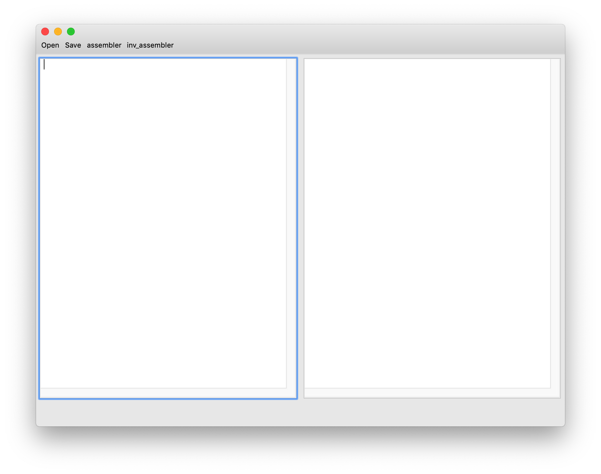
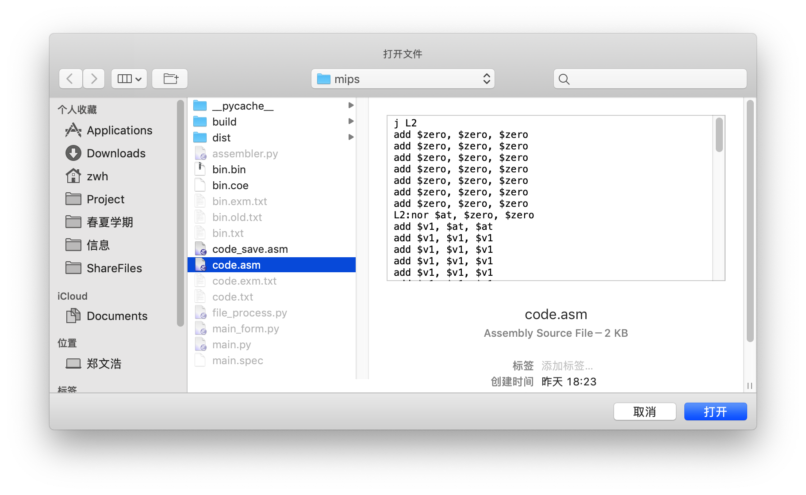
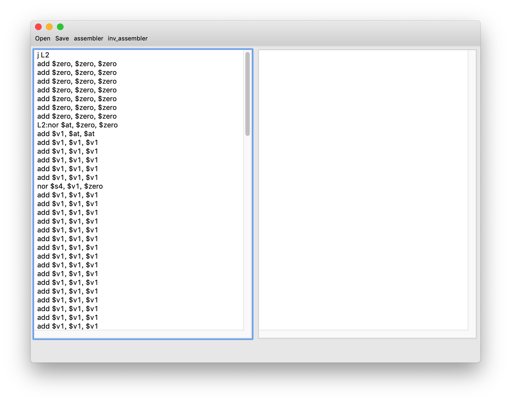
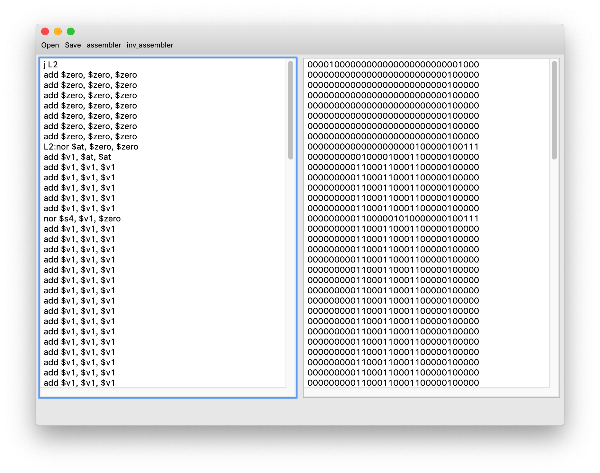
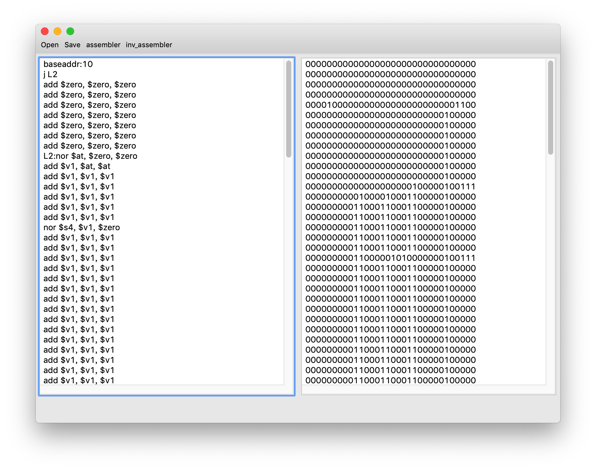
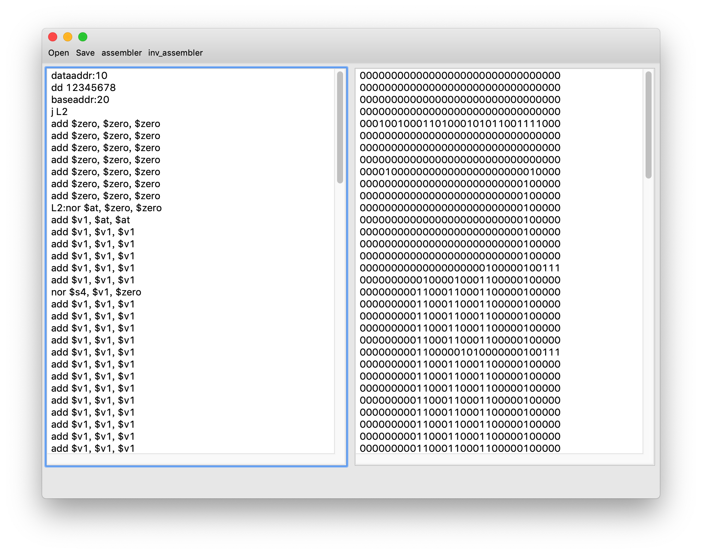
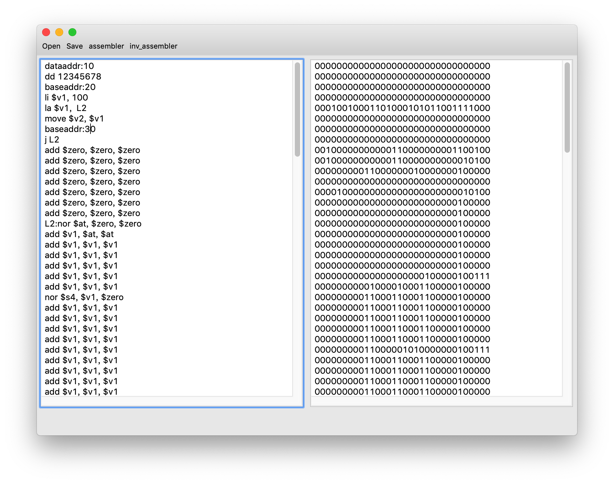

 MIPS assembler </align>

## 功能

### 指令集

支持31 条 mips 基本指令的汇编与反汇编。

支持使用 baseaddr 与 dataaddr 跳转存储器指针，未定义部分使用 0x00000000 填充。

支持 dd 伪指令定义 32 位数据。(使用 db 与 dw 指令后需要对齐到 4 字节等价于 dd 指令)，dd 指令不支持反汇编。

支持伪指令 la、li、move的汇编与反汇编。(move 使用 add 指令实现，la 与li 使用 addi 指令实现，所有的伪指令反汇编之后都会变成实际执行的指令)

### 文件操作

支持打开、保存 asm、bin、coe 文件，并能自动根据打开、保存的格式选择读取或读入的是汇编代码或二进制码。

### 指令要求

bin 文件中的二进制码应当是机器码连续储存的，既开头、结尾和中间不应有其他内容。每四个字节为一条指令。

coe 文件可以使用任意进制，但是每条指令都应用"，"隔开。

asm 文件中应当每条汇编代码占据一行，可以有空行。注释支持 # 与 // 两种格式。指令末尾的'；'可有可无。

## 效果展示

程序主页面如下

Open、Save、assembler 与 inv_assembler 分别为打开文件、保存文件、汇编与反汇编。

中间两个框分别展示汇编代码与机器码。

下面是打开文件时的样子。

打开 asm 文件后，程序将自动解析文件并将汇编代码放入对应的框中。

使用 assembler 按钮进行汇编。

右面的框中将会显示对应的机器码。

可以使用 baseaddr 改变代码段在存储器中的位置。

baseaddr 指令应后跟"："其后的数字应按照十六进制书写。数字是字节地址与指令条数存在 4 倍的关系。

同样可以使用 dataaddr 在存储器中定义数据。

可以看到使用 addr 指令可以改变汇编代码在汇编时的位置，并且不会引起 branch 和 j 指令的标志出现错误。

li、la 与 move 指令通过 addi 与 add 指令实现，可以从下面的汇编结果中看出。

li 指令使用的立即数应当使用十六进制(所有i 格式的指令中的立即数都使用十六进制)。

la 所使用的标记与 j 格式 branch 指令是相同的，可以看到 la 指令中的L2 的值与 j 指令中 L2的值是一样的。

## EXE 可执行文件

可执行文件可能在不同的环境下因为相关配置和路径等问题导致错误。在我的电脑上已经进行了测试，可以实现报告重要求的汇编与反汇编的功能，但是因为 UI 界面并不是在 win 下设计的所以界面上的按钮存在重叠现象并不影响使用。

main 文件是 Unix 系统下的可执行文件，但是可能因为 Python 版本问题导致框架出错程序无法运行。

main.app 是 macOS 下可以使用的程序，该版本因为与开发环境相同不存在相关问题，可以正常使用，与报告中的截图效果一致。